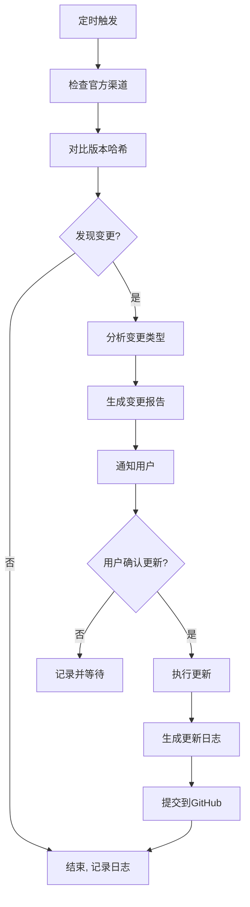

# Skill: Claude Code教程自动更新维护

## 📋 技能描述

自动追踪Claude Code官方变更，持续更新教程内容，确保教程始终与官方最新版本保持一致。

### 🔧 功能
- 每日自动检查Claude Code官方更新
- 监测版本发布、功能变更、文档更新
- 生成变更报告和更新建议
- 自动同步更新到教程内容
- 版本管理和更新日志维护

### ⚙️ 配置参数

```yaml
name: claudecode-tutorial-updater
version: 1.0.0
description: 自动更新Claude Code教程
schedule: "0 2 * * *"  # 每天凌晨2点执行
check_channels:
  - official_docs: "https://docs.anthropic.com/claude/docs"
  - github_repo: "https://github.com/anthropics/claude-code"
  - release_notes: "https://www.anthropic.com/release-notes"
  - plugin_market: "https://plugins.claude.ai"
  - discord_announcements: "https://discord.gg/anthropic"
priority:
  critical: 24h
  major: 72h
  minor: 168h
update_scope:
  - core_modules: true
  - official_plugins: true
  - model_information: true
  - api_reference: true
  - best_practices: true
```

---

## 🚀 工作流程

### 1. 每日检查流程


### 2. 变更分析逻辑
```python
def analyze_change(change_content):
    change_type = classify_change(change_content)
    
    if change_type == "new_core_feature":
        return {
            "priority": "critical",
            "update_required": ["new_chapter", "update_diagrams", "update_examples"],
            "estimated_hours": 8
        }
    elif change_type == "new_plugin":
        return {
            "priority": "major",
            "update_required": ["update_chapter13", "update_examples"],
            "estimated_hours": 4
        }
    elif change_type == "model_update":
        return {
            "priority": "major",
            "update_required": ["update_chapter14", "update_comparison"],
            "estimated_hours": 3
        }
    elif change_type == "api_change":
        return {
            "priority": "critical",
            "update_required": ["update_all_code_examples", "update_faq"],
            "estimated_hours": 6
        }
    elif change_type == "doc_update":
        return {
            "priority": "minor",
            "update_required": ["sync_docs", "update_examples"],
            "estimated_hours": 2
        }
```

---

## 📊 监测渠道详细

### 1. 官方文档监测
- 爬取所有官方文档页面
- 对比内容哈希值变化
- 识别新增/修改/删除的内容
- 提取变更说明和API更新

### 2. GitHub仓库监测
- 监控主分支提交记录
- 分析Release标签更新
- 检查Issue和PR中的重要变更
- 跟踪代码结构和API变化

### 3. 插件市场监测
- 扫描官方插件列表
- 监测新插件发布
- 跟踪已有插件的版本更新
- 提取插件功能变更

### 4. 发布公告监测
- 监控官方博客和发布公告
- 抓取大版本更新信息
- 识别功能升级和性能优化
- 跟踪价格和政策变更

### 5. 社区动态监测
- 监控Discord官方频道
- 收集开发者反馈和常见问题
- 跟踪官方对问题的回应
- 识别即将发布的功能预告

---

## 🔄 更新执行流程

### 1. 核心模块更新
```
检测到新核心功能 → 新增对应章节 → 添加代码示例 →
绘制相关图表 → 更新相关章节引用 → 更新FAQ/GLOSSARY →
更新学习路径 → 测试验证 → 提交发布
```

### 2. 插件内容更新
```
检测到新插件/插件更新 → 更新第13章对应内容 →
添加使用示例 → 更新最佳实践 → 更新插件选择指南 →
提交发布
```

### 3. 模型信息更新
```
检测到新模型发布/模型更新 → 更新第14章 →
更新性能/价格/速度对比表 → 添加新模型推荐 →
更新成本优化策略 → 更新选择流程图 → 提交发布
```

### 4. API变更更新
```
检测到API接口变更 → 搜索所有章节的相关代码示例 →
批量更新代码示例 → 更新错误排查内容 → 更新FAQ →
提交发布
```

---

## 📝 版本管理

### 版本号规则
```
v<主版本>.<次版本>.<修订号>
  └── 主版本：对应Claude Code大版本更新
  └── 次版本：对应重要功能更新/新增章节
  └── 修订号：对应小功能优化/内容修正
```

### 更新日志模板
```markdown
## v2.1.0 (2026-XX-XX)
### 🎯 对应Claude Code版本：2.1.0
### ✨ 新增内容
- 新增第15章：XXX新系统详解
- 添加XXX新插件完整文档
- 更新XXX模型性能对比

### 🔧 优化内容
- 同步更新所有API示例到最新版本
- 优化XXX章节的代码示例
- 补充XXX最佳实践

### 🐛 修复
- 修正XXX章节的错误描述
- 更新过时的配置参数
```

---

## 💡 使用方法

### 手动触发检查
```bash
# 立即执行一次更新检查
/claudecode-update check

# 强制更新到最新版本
/claudecode-update force-update

# 查看最近更新记录
/claudecode-update history

# 查看当前版本信息
/claudecode-update version
```

### 配置调整
```yaml
# 修改检查频率
schedule: "0 2 * * *"  # 每天凌晨2点
# schedule: "0 */6 * * *"  # 每6小时检查一次
# schedule: "0 * * * *"    # 每小时检查一次

# 添加自定义监测渠道
custom_channels:
  - name: "内部文档"
    url: "https://internal.example.com/docs"
    check_interval: 12h
```

---

## 🚨 告警机制

### 重要更新告警
当检测到以下变更时，会立即通知用户：
- ✅ 大版本发布
- ✅ 核心功能变更
- ✅ API接口不兼容更新
- ✅ 安全相关更新
- ✅ 重要新插件发布

### 通知方式
- 飞书消息通知
- 包含变更类型、影响范围、预计更新时间
- 附带详细的变更报告和更新建议

---

## ✅ 技能特点

### 🔒 可靠性
- 多重渠道交叉验证，避免误报
- 变更内容人工审核确认，保证更新质量
- 完整的版本回滚机制
- 定期备份所有内容

### ⚡ 响应速度
- 紧急变更：24小时内完成更新
- 重要变更：72小时内完成更新
- 一般变更：1周内完成更新
- 小优化：随时更新

### 📊 透明性
- 所有更新都有详细记录
- 更新日志公开可查
- 变更来源可追溯
- 用户可以随时查看更新进度

---

## 🎯 维护承诺

本技能将长期运行，确保Claude Code教程始终保持最新、最准确的状态，为所有学习者提供最权威的中文学习资源。
